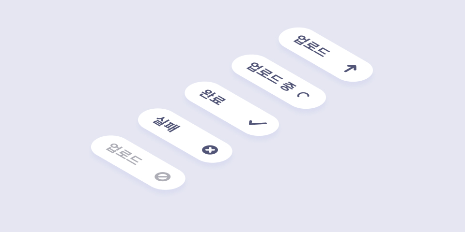
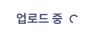
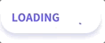

###### Connect To Front-end

# React 컴포넌트 작성 실습

아이콘, 업로드 버튼 컴포넌트 디자인 → 개발하기

[→ 디자인 파일](https://www.figma.com/file/e2T9E3bXaF54BBD2KGlWyi/Icon%2C-UploadButton/duplicate)



## SvgIcon

SVG 아이콘 컴포넌트입니다.

<div>
  
  
  
  
  
</div>

### 기본 사용법

기본적인 컴포넌트 사용 방법은 다음과 같습니다.

```jsx
<SvgIcon type="cross" />
```

### 타입 설정

아이콘 모양을 `type` 속성을 사용해 설정합니다.

| 타입(type)  | 모양(shape)                                                           |
| ----------- | --------------------------------------------------------------------- |
| up-arrow    |                     |
| spinner     |  |
| check-mark  |                   |
| cross       |                        |
| not-allowed |                  |

### 사용자 정의 설정

SVG 아이콘 모양, 크기, 색상, 접근 가능한 레이블 등 사용자 요구사항에 맞게 조정할 수 있는 기능을 제공합니다.

```jsx
<SvgIcon type="check-mark" size={26} color="#00e2b1" title="승인" />
```

## UploadButton

업로드 버튼 컴포넌트입니다.

<div>
  
  
  
  
  
</div>

### 기본 사용법

기본적인 컴포넌트 사용 방법은 다음과 같습니다.

```jsx
<UploadButton />
```

`disabled` 속성이 설정되면 컴포넌트는 비활성 상태로 렌더링 됩니다.

```jsx
<UploadButton disabled />
```

### 상태 설정

사용자에게 상태(네트워크, 업로드 성공 여부 등)에 따라 정보를 인지할 수 있도록 `status` 속성을 설정할 수 있습니다.

**대기**

```jsx
<UploadButton status="idle" />
```


**로딩**

```jsx
<UploadButton status="pending" />
```


**성공**

```jsx
<UploadButton status="resolved" />
```


**실패**

```jsx
<UploadButton status="rejected" />
```


**비활성**

```jsx
<UploadButton status="disabled" />
```


### 사용자 정의 설정

버튼 레이블, 언어, 타이틀, 상태, 색상, 아이콘 크기 등 사용자 요구사항에 맞게 조정할 수 있는 기능을 제공합니다.

```jsx
<UploadButton
  lang="en"
  title="로딩 중..."
  status="pending"
  color="#706efd"
  size={16}
>
  loading
</UploadButton>
```


